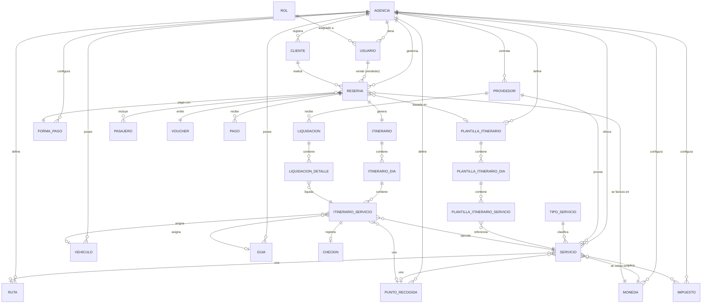

# Sistema SaaS para Agencias de Turismo — Modelo de Datos

Continuación del documento maestro de alcance y arquitectura funcional.
Este documento define el modelo de datos (entidades, campos clave y relaciones) que soporta el flujo:

`vendedor crea reserva -> selecciona servicio/plantilla -> define fecha y pasajeros -> voucher + QR -> operación hace check-in`

---

## 1. Diagrama Entidad-Relación (Mermaid)

---

## 2. Entidades y campos clave

### Núcleo / Multi-tenant

**Agencia**
- id, nombre, razon_social, rut_o_nit, logo_url, dominio_subdominio, plan (fase1/fase2/fase3), estado, timezone, created_at

**Usuario**
- id, agencia_id, rol_id, nombre, email, password_hash, telefono, estado, ultimo_login, created_at

**Rol**
- id, nombre (admin, vendedor, operacion, finanzas), permisos (json)

### Comercial

**Cliente**
- id, agencia_id, nombre, documento, email, telefono, pais, notas, created_at

**Vendedor** *(puede modelarse como Usuario con rol="vendedor"; se mantiene como vista/mantenedor, no tabla separada)*
- comisión_pct, meta_mensual (campos extendidos sobre Usuario si aplica)

**Reserva**
- id, agencia_id, cliente_id, vendedor_id (usuario_id), codigo_reserva, estado (pendiente/confirmada/operada/cancelada), fecha_creacion, fecha_servicio_inicio, fecha_servicio_fin, total, moneda_id, forma_pago_id, plantilla_itinerario_id (nullable), qr_code, voucher_id

**Pasajero**
- id, reserva_id, nombre, documento, tipo (adulto/niño/infante), nacionalidad

**Voucher**
- id, reserva_id, codigo, qr_url, pdf_url, emitido_at, valido_hasta

### Operación

**Proveedor**
- id, agencia_id, nombre, tipo (hotel, transportista, guía freelance, etc.), contacto, condiciones_pago, cuenta_bancaria, estado

**TipoServicio**
- id, nombre (tour, traslado, hospedaje, actividad náutica, etc.), descripcion

**Servicio**
- id, agencia_id, proveedor_id, tipo_servicio_id, nombre, descripcion, capacidad_max, duracion_min, precio_base, moneda_id, ruta_id (nullable), punto_recogida_id (nullable), estado

**PlantillaItinerario**
- id, agencia_id, nombre, descripcion, dias_totales, estado

**PlantillaItinerarioDia**
- id, plantilla_itinerario_id, numero_dia

**PlantillaItinerarioServicio**
- id, plantilla_itinerario_dia_id, servicio_id, hora_inicio, orden

**Itinerario** *(instancia real, generada a partir de una reserva)*
- id, reserva_id, plantilla_itinerario_id (origen, opcional)

**ItinerarioDia**
- id, itinerario_id, fecha, numero_dia

**ItinerarioServicio**
- id, itinerario_dia_id, servicio_id, hora_inicio, hora_fin, vehiculo_id (nullable), guia_id (nullable), punto_recogida_id (nullable), estado (pendiente/en curso/completado/no-show)

**CheckIn**
- id, itinerario_servicio_id, usuario_operacion_id, fecha_hora, metodo (qr/manual), observaciones

### Mantenedores operativos

**Vehiculo**
- id, agencia_id, patente, tipo, capacidad, proveedor_id (nullable, si es tercerizado), estado

**Guia**
- id, agencia_id, nombre, idiomas, licencia, telefono, proveedor_id (nullable), estado

**Ruta**
- id, agencia_id, nombre, origen, destino, duracion_estimada_min, distancia_km

**PuntoRecogida**
- id, agencia_id, nombre, direccion, lat, lng, referencia

### Finanzas

**Moneda**
- id, agencia_id, codigo (USD, PEN, CLP...), simbolo, tasa_cambio, es_principal

**Impuesto**
- id, agencia_id, nombre, porcentaje, aplica_a (servicio/reserva)

**FormaPago**
- id, agencia_id, nombre (efectivo, tarjeta, transferencia, pasarela), config (json)

**Pago**
- id, reserva_id, forma_pago_id, monto, moneda_id, fecha, referencia_externa, estado

**Liquidacion**
- id, proveedor_id, periodo_inicio, periodo_fin, total, estado (pendiente/pagada), fecha_pago

**LiquidacionDetalle**
- id, liquidacion_id, itinerario_servicio_id, monto, comision_agencia

---

## 3. Reglas de negocio implícitas en el modelo

1. **Multi-tenant desde el día 1**: casi todas las tablas cuelgan de `agencia_id`, lo que permite pasar de Fase 1 (una agencia) a Fase 3 (SaaS multi-agencia) sin rediseñar el esquema — solo cambia el aislamiento (row-level security / schema por tenant, a decidir en fase 2).
2. **Itinerario ≠ Plantilla**: la plantilla es reutilizable y editable; el itinerario es una copia "congelada" generada al confirmar la reserva, para no romper reservas pasadas si la plantilla cambia.
3. **Servicio es la unidad atómica**: tours, traslados, hoteles y lanchas son todos `Servicio` con `tipo_servicio_id` distinto — evita tablas paralelas por tipo.
4. **Trazabilidad operación → finanzas**: `ItinerarioServicio` es el punto donde se conecta el check-in (operación) con `LiquidacionDetalle` (finanzas hacia el proveedor), permitiendo liquidar solo lo efectivamente ejecutado.
5. **Vendedor = Usuario con rol**, evitando duplicar identidad; los mantenedores "Vendedores" del dashboard son una vista filtrada de `Usuario` por rol.

---

## 4. Próximos pasos sugeridos

- [ ] Traducir este modelo a `schema.prisma` (PostgreSQL) para Fase 1.
- [ ] Definir estrategia de aislamiento multi-tenant para Fase 2 (columna `agencia_id` + RLS de Postgres es la opción más simple de escalar).
- [ ] Diseñar los endpoints REST/GraphQL de NestJS por módulo (comercial, operación, finanzas, mantenedores).
- [ ] Definir el estándar del QR del voucher (payload firmado con JWT corto, para validar check-in sin consultar base de datos en tiempo real).
